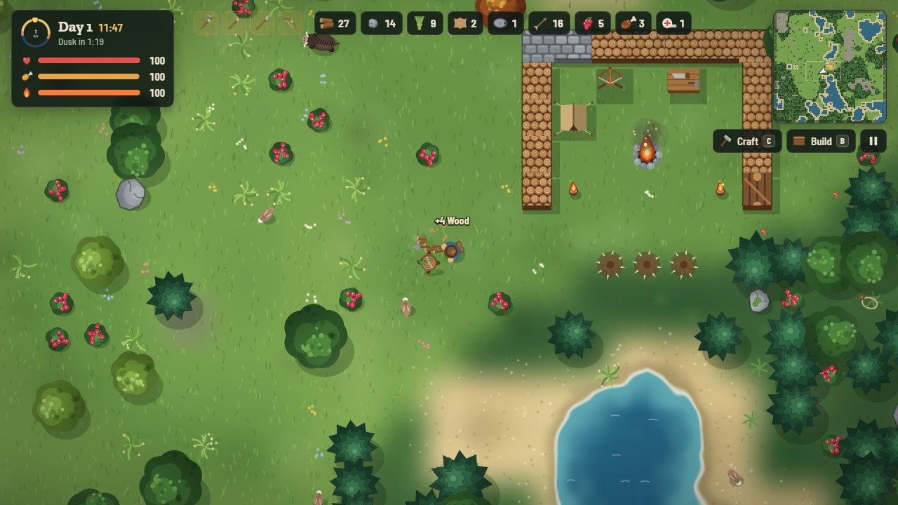
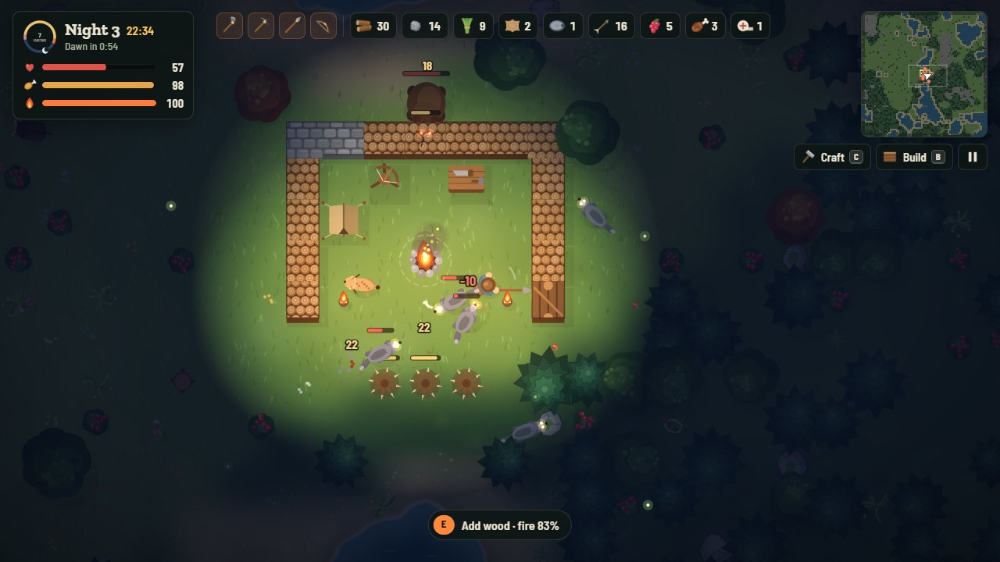

# Last Ember



A fast, top-down survival game that runs in your browser. Gather and hunt by day, keep your campfire burning, and hold out against the predators that come each night. Every night brings more of them. Runs are short, and there is no story to grind through.

**[Play in your browser](https://netanelyan.github.io/lastember/)**

It works on a computer with keyboard and mouse, and on phones and tablets with touch controls.

## How a run works

1. **Day** (about two minutes): chop trees, break rocks, pick berries, hunt, craft tools and build up your camp.
2. **Dusk**: the light starts going. Feed your fire.
3. **Night**: wolves, lynx and bears come for you. There are more each night, and every fifth night an alpha wolf leads the pack.
4. **Dawn**: you made it. Pick one of three perks, which you keep for the rest of the run.

Your score is the number of nights you survive.



## Controls

| Action | Keyboard and mouse | Touch |
| --- | --- | --- |
| Move | `W` `A` `S` `D` or arrow keys | Left thumb (joystick) |
| Sprint | `Shift` | Push the joystick to the edge |
| Roll (dodges attacks) | `Space` | Roll |
| Swing: chop, mine, fight | Left click | Big button (aims for you) |
| Shoot your bow | Right click | Bow button (aims at the nearest animal) |
| Feed the fire, repair, load | `E` | Use |
| Eat / use a bandage | `F` / `Q` | Eat / Heal |
| Craft / build | `C` / `B` | Buttons next to the map |
| Pick a building | `1`–`0`, `X` to remove | Tap a card |
| Place it | Click the ground (hold and drag for walls) | Tap the ground (drag for walls) |
| Pause | `Esc` | Pause button |
| Mute | `M` | Pause menu |

## What's in it

- **Hunting**: rabbits and deer bolt but tire after a few seconds of running. Boars charge back. You can spear fish from the shore, and snares catch rabbits while you're busy elsewhere.
- **Camping**: the campfire gives warmth and light, and it cooks raw meat and fish when you stand next to it. A tent brings you back once if you fall.
- **Building**: wood and stone walls, gates, spikes, torches, snares, a workbench, a tent and a spring bow that shoots predators on its own.
- **Crafting**: stone axe, pickaxe, spear, hunting bow and arrows, bandages, hide armor, a fur cloak and a fang blade made from predator teeth.
- **Predators**: wolves circle outside bright firelight before they attack. A lynx crouches, then pounces. Bears ignore the light and tear through wood walls. All of them find a way around your walls, and when there isn't one, they break through the weakest spot.
- **Seasons**: snow starts on night 4. From day 7 it is winter, and even the days are cold.
- **Perks**: 15 upgrades such as faster movement, longer-burning fires, stronger arrows or healing whenever you kill a predator.

The game saves at each dawn and whenever you pause, so you can close the tab and pick up later with **Continue**.

## Field notes

- A full campfire burns for about 3 minutes at night. Each log adds about 20 seconds.
- Warmth drops at night unless you're near a fire. Hunger drops all the time.
- Raw food fills you a little but costs 4 health. Cook it first.
- Roll through an attack. You can't be hurt mid-roll.
- A gate lets you through, but predators can't use it.

## Run it locally

There is no build step and nothing to install. Clone the repo and open `index.html`, or serve the folder:

```sh
git clone https://github.com/netanelyan/lastember.git
cd lastember
python -m http.server 8000
```

Then open <http://localhost:8000>.

## Project layout

```
index.html       page markup: HUD, menus, touch controls
css/style.css    all styling, including the phone layouts
js/util.js       math, seeded randomness, noise, storage helpers
js/data.js       balance tables: items, recipes, structures, creatures, perks, waves
js/audio.js      sound effects and ambience, synthesized with Web Audio
js/input.js      keyboard, mouse, joystick and touch buttons
js/world.js      map generation, trees/rocks/bushes, collision
js/sprites.js    trees, rocks and icons painted in code
js/render.js     terrain, creatures, lighting and night effects
js/game.js       player, animal and predator AI, building, day/night cycle, waves, saving
js/ui.js         HUD, panels and menus
js/main.js       startup and the main loop
```

Everything is drawn in code on a canvas, so there are no image or audio files. Most of the balance lives in `js/data.js`: day and night length, hunger rate, how fast fires burn, recipe costs, creature stats and wave sizes (`waveFor`). Change a number and reload.
